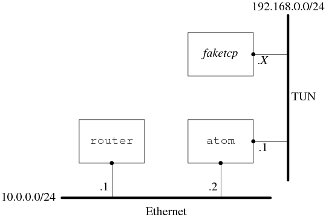

上一篇文章主要讲述了**TUN/TAP**设备的一些原理，你可能会好奇，**TUN/TAP**设备究竟有什么用处呢？所以这篇文章，我想用一些实际的例子来回答这个问题。

例子源自陈硕老师的博客，博文中关于TUN/TAP设备的使用非常典型，对原文感兴趣的同学可以查看这里：在[http://blog.csdn[.NET](http://lib.csdn.net/base/dotnet)/solstice/article/details/6579232](http://blog.csdn[.NET](http://lib.csdn.net/base/dotnet)/solstice/article/details/6579232)


背景：在一台 **PC** 机上模拟 **TCP** 客户端程序发起连接请求，同时在该 **PC** 上创建虚拟网卡 **tun0**，接收连接请求并送至 **faketcp** 应用程序，用于模拟 **TCP** 服务器端进行响应。

网络的拓扑结构如下：



具体做法是：在主机 **atom** 上通过打开 **/dev/net/tun** 设备来创建一个 **tun0** 虚拟网卡，然后把这个网卡的地址设为`192.168.0.1/24`，这样 **faketcp** 程序就扮演了`192.168.0.0/24` 这个网段上的所有机器。**atom** 发给`192.168.0.2` ～ `192.168.0.254`的 **IP** 数据包都会发给 **faketcp** 程序，**faketcp** 程序可以模拟其中任何一个**IP** 给**atom** 发 **IP** 数据包。

程序分成几步来实现。

第一步：实现 **icmp echo** 协议，这样就能 **ping** 通 **faketcp** 了：

**faketcp.h**:

```c++
#include <algorithm>  // std::swap

#include <assert.h>
#include <stdint.h>
#include <string.h>
#include <arpa/inet.h>  // inet_ntop
#include <net/if.h>

struct SocketAddr
{
  uint32_t saddr, daddr;  // 源地址和目的地址
  uint16_t sport, dport;  // 源端口和目的端口

  bool operator==(const SocketAddr& rhs) const
  {
    return saddr == rhs.saddr && daddr == rhs.daddr && 
	    sport == rhs.sport && dport == rhs.dport;
  }

  bool operator<(const SocketAddr& rhs) const
  {
    return memcmp(this, &rhs, sizeof(rhs)) < 0;
  }
};

int tun_alloc(char dev[IFNAMSIZ]);
uint16_t in_checksum(const void* buf, int len);

void icmp_input(int fd, const void* input, const void* payload, int len);

```

**faketcp.cc**:

```c++
#include "faketcp.h"

#include <fcntl.h>
#include <stdio.h>
#include <string.h>
#include <unistd.h>
#include <linux/if_tun.h>
#include <netinet/in.h>
#include <netinet/ip_icmp.h>
#include <sys/ioctl.h>

int sethostaddr(const char* dev)
{
  struct ifreq ifr;
  bzero(&ifr, sizeof(ifr));
  strcpy(ifr.ifr_name, dev);
  struct sockaddr_in addr;
  bzero(&addr, sizeof addr);
  addr.sin_family = AF_INET;
  inet_pton(AF_INET, "192.168.0.1", &addr.sin_addr);
  //addr.sin_addr.s_addr = htonl(0xc0a80001);
  bcopy(&addr, &ifr.ifr_addr, sizeof addr);
  int sockfd = socket(AF_INET, SOCK_DGRAM, 0);
  if (sockfd < 0)
    return sockfd;
  int err = 0;
  // ifconfig tun0 192.168.0.1
  if ((err = ioctl(sockfd, SIOCSIFADDR, (void *) &ifr)) < 0)
  {
    perror("ioctl SIOCSIFADDR");
    goto done;
  }
  // ifup tun0 其实就是启动tun0
  if ((err = ioctl(sockfd, SIOCGIFFLAGS, (void *) &ifr)) < 0)
  {
    perror("ioctl SIOCGIFFLAGS");
    goto done;
  }
  ifr.ifr_flags |= IFF_UP;
  if ((err = ioctl(sockfd, SIOCSIFFLAGS, (void *) &ifr)) < 0)
  {
    perror("ioctl SIOCSIFFLAGS");
    goto done;
  }
  // ifconfig tun0 192.168.0.1/24 # 配置子网掩码
  inet_pton(AF_INET, "255.255.255.0", &addr.sin_addr);
  bcopy(&addr, &ifr.ifr_netmask, sizeof addr);
  if ((err = ioctl(sockfd, SIOCSIFNETMASK, (void *) &ifr)) < 0)
  {
    perror("ioctl SIOCSIFNETMASK");
    goto done;
  }
done:
  close(sockfd);
  return err;
}

int tun_alloc(char dev[IFNAMSIZ])
{
  struct ifreq ifr;
  int fd, err;

  if ((fd = open("/dev/net/tun", O_RDWR)) < 0)
  {
    perror("open");
    return -1;
  }

  bzero(&ifr, sizeof(ifr));
  ifr.ifr_flags = IFF_TUN | IFF_NO_PI; // tun设备不包含以太网头部,而tap包含,仅此而已

  if (*dev)
  {
    strncpy(ifr.ifr_name, dev, IFNAMSIZ); // 设定设备的名称
  }

  if ((err = ioctl(fd, TUNSETIFF, (void *) &ifr)) < 0)
  {
    perror("ioctl TUNSETIFF");
    close(fd);
    return err;
  }
  strcpy(dev, ifr.ifr_name);
  if ((err = sethostaddr(dev)) < 0) // 设定地址等信息
    return err;

  return fd;
}

uint16_t in_checksum(const void* buf, int len)
{
  assert(len % 2 == 0);
  const uint16_t* data = static_cast<const uint16_t*>(buf);
  int sum = 0;
  for (int i = 0; i < len; i+=2)
  {
    sum += *data++;
  }
  while (sum >> 16)
    sum = (sum & 0xFFFF) + (sum >> 16);
  assert(sum <= 0xFFFF);
  return ~sum;
}

void icmp_input(int fd, const void* input, const void* payload, int len)
{
  const struct iphdr* iphdr = static_cast<const struct iphdr*>(input); // ip头部
  const struct icmphdr* icmphdr = static_cast<const struct icmphdr*>(payload); // icmp头部
  // const int icmphdr_size = sizeof(*icmphdr);
  const int iphdr_len = iphdr->ihl*4;

  if (icmphdr->type == ICMP_ECHO)
  {
    char source[INET_ADDRSTRLEN];
    char dest[INET_ADDRSTRLEN];
    inet_ntop(AF_INET, &iphdr->saddr, source, INET_ADDRSTRLEN);
    inet_ntop(AF_INET, &iphdr->daddr, dest, INET_ADDRSTRLEN);
    printf("%s > %s: ", source, dest);
    printf("ICMP echo request, id %d, seq %d, length %d\n",
           ntohs(icmphdr->un.echo.id),
           ntohs(icmphdr->un.echo.sequence),
           len - iphdr_len);

    union
    {
      unsigned char output[ETH_FRAME_LEN]; // 以太网头部
      struct
      {
        struct iphdr iphdr;
        struct icmphdr icmphdr;
      } out;
    };

    memcpy(output, input, len);
    out.icmphdr.type = ICMP_ECHOREPLY;
    out.icmphdr.checksum += ICMP_ECHO; // FIXME: not portable
    std::swap(out.iphdr.saddr, out.iphdr.daddr);
    write(fd, output, len);
  }
}

```

**icmpecho.cc**:

```c++
#include "faketcp.h"

#include <stdio.h>
#include <stdlib.h>
#include <string.h>
#include <unistd.h>
#include <netinet/ip.h>
#include <linux/if_ether.h>

int main()
{
  char ifname[IFNAMSIZ] = "tun%d";
  int fd = tun_alloc(ifname); // tun_alloc函数主要用于开启

  if (fd < 0)
  {
    fprintf(stderr, "tunnel interface allocation failed\n");
    exit(1);
  }

  printf("allocted tunnel interface %s\n", ifname);
  sleep(1);

  for (;;)
  {
    union
    {
      unsigned char buf[ETH_FRAME_LEN]; // 以太网头部
      struct iphdr iphdr;	// ip头部
    };

    const int iphdr_size = sizeof iphdr; // ip头部默认是20字节

    int nread = read(fd, buf, sizeof(buf));
    if (nread < 0)
    {
      perror("read");
      close(fd);
      exit(1);
    }
    printf("read %d bytes from tunnel interface %s.\n", nread, ifname);

    const int iphdr_len = iphdr.ihl*4;
    if (nread >= iphdr_size
        && iphdr.version == 4
        && iphdr_len >= iphdr_size
        && iphdr_len <= nread
        && iphdr.tot_len == htons(nread)
        && in_checksum(buf, iphdr_len) == 0)
    {
      const void* payload = buf + iphdr_len;
      if (iphdr.protocol == IPPROTO_ICMP)  // icmp协议
      {
        icmp_input(fd, buf, payload, nread);
      }
    }
    else
    {
      printf("bad packet\n");
      for (int i = 0; i < nread; ++i)
      {
        if (i % 4 == 0) printf("\n");
        printf("%02x ", buf[i]);
      }
      printf("\n");
    }
  }
  return 0;
}

```

运行方法，打开3个命令行窗口：

1. 在第1个窗口运行` sudo ./icmpecho`，程序显示：

```shell
allocted tunnel interface tun0
```

2.  在第2个窗口运行：

```shell
$ sudo ifconfig tun0 192.168.0.1/24 # 设定ip地址

$ sudo tcpdump -i tun0  # 用tcpdump抓取通过接口tun0的数据包
```

3. 在第3个窗口运行：
```shell
$ ping 192.168.0.2

$ ping 192.168.0.3

$ ping 192.168.0.234
```

发现每个`192.168.0.X` 的**IP** 都能 **ping** 通。


第二步：实现拒接 **TCP** 连接的功能，即在收到SYN TCP segment的时候发送**RST segment**。

**rejectall.cc**:

```c++
#include "faketcp.h"

#include <stdio.h>
#include <stdlib.h>
#include <string.h>
#include <unistd.h>
#include <netinet/ip.h>
#include <netinet/tcp.h>
#include <linux/if_ether.h>

void tcp_input(int fd, const void* input, const void* payload, int tot_len)
{
  const struct iphdr* iphdr = static_cast<const struct iphdr*>(input); // ip头部
  const struct tcphdr* tcphdr = static_cast<const struct tcphdr*>(payload); // tcp头部
  const int iphdr_len = iphdr->ihl*4; // ip头部的大小
  const int tcp_seg_len = tot_len - iphdr_len; // tcp报文的大小
  const int tcphdr_size = sizeof(*tcphdr);
  if (tcp_seg_len >= tcphdr_size
      && tcp_seg_len >= tcphdr->doff*4)
  {
    const int tcphdr_len = tcphdr->doff*4;

    if (tcphdr->syn) // 收到了SYN分节
    {
      char source[INET_ADDRSTRLEN];
      char dest[INET_ADDRSTRLEN];
      inet_ntop(AF_INET, &iphdr->saddr, source, INET_ADDRSTRLEN); // 将ip转化为可读的字符串
      inet_ntop(AF_INET, &iphdr->daddr, dest, INET_ADDRSTRLEN);
      printf("IP %s.%d > %s.%d: ",
             source, ntohs(tcphdr->source), dest, ntohs(tcphdr->dest));
      printf("Flags [S], seq %u, win %d, length %d\n",
             ntohl(tcphdr->seq), // 序列号
             ntohs(tcphdr->window), // 窗口大小
             tot_len - iphdr_len - tcphdr_len);

      union
      {
        unsigned char output[ETH_FRAME_LEN];
        struct
        {
          struct iphdr iphdr;
          struct tcphdr tcphdr;
        } out;
      };

      assert(sizeof(out) == sizeof(struct iphdr) + sizeof(struct tcphdr));
      int output_len = sizeof(out);
      bzero(&out, output_len + 4);
      memcpy(output, input, sizeof(struct iphdr));
      
      out.iphdr.tot_len = htons(output_len);
      std::swap(out.iphdr.saddr, out.iphdr.daddr);
      out.iphdr.check = 0;
      out.iphdr.check = in_checksum(output, sizeof(struct iphdr));
      out.tcphdr.source = tcphdr->dest;  // 源地址和目的地址对调
      out.tcphdr.dest = tcphdr->source;
      out.tcphdr.seq = 0;
      out.tcphdr.ack_seq = htonl(ntohl(tcphdr->seq)+1); // 确认序列号
      out.tcphdr.doff = sizeof(struct tcphdr) / 4;
      out.tcphdr.ack = 1;
      out.tcphdr.rst = 1; // 注意这里的RST分节
      out.tcphdr.window = 0;
      unsigned char* pseudo = output + output_len;
      pseudo[0] = 0;
      pseudo[1] = IPPROTO_TCP;
      pseudo[2] = 0;
      pseudo[3] = sizeof(struct tcphdr);
      out.tcphdr.check = in_checksum(&out.iphdr.saddr, sizeof(struct tcphdr)+12);
      write(fd, output, output_len);
    }
  }
}

int main()
{
  char ifname[IFNAMSIZ] = "tun%d";
  int fd = tun_alloc(ifname);

  if (fd < 0)
  {
    fprintf(stderr, "tunnel interface allocation failed\n");
    exit(1);
  }

  printf("allocted tunnel interface %s\n", ifname);
  sleep(1);

  for (;;)
  {
    union
    {
      unsigned char buf[ETH_FRAME_LEN];
      struct iphdr iphdr;
    };

    const int iphdr_size = sizeof iphdr;

    int nread = read(fd, buf, sizeof(buf));
    if (nread < 0)
    {
      perror("read");
      close(fd);
      exit(1);
    }
    printf("read %d bytes from tunnel interface %s.\n", nread, ifname);

    const int iphdr_len = iphdr.ihl*4;
    if (nread >= iphdr_size
        && iphdr.version == 4
        && iphdr_len >= iphdr_size
        && iphdr_len <= nread
        && iphdr.tot_len == htons(nread)
        && in_checksum(buf, iphdr_len) == 0)
    {
      const void* payload = buf + iphdr_len;
      if (iphdr.protocol == IPPROTO_ICMP)
      {
        icmp_input(fd, buf, payload, nread);
      }
      else if (iphdr.protocol == IPPROTO_TCP)
      {
        tcp_input(fd, buf, payload, nread);
      }
    }
    else
    {
      printf("bad packet\n");
      for (int i = 0; i < nread; ++i)
      {
        if (i % 4 == 0) printf("\n");
        printf("%02x ", buf[i]);
      }
      printf("\n");
    }
  }

  return 0;
}
```

运行方法，打开3个命令行窗口，头两个窗口的操作与前面相同，运行的**faketcp** 程序是 `./rejectall`。

3. 在第3个窗口运行

```shell

$ nc 192.168.0.2  2000

$ nc 192.168.0.2  3333

$ nc 192.168.0.7  5555
```

发现向其中任意一个 **IP** 发起的 **TCP** 连接都被拒接了。

第三步：实现接受 **TCP** 连接的功能，即在接收到SYN TCP segment的时候发回 SYN + ACK。这个程序同时处理了连接断开的情况，即在收到FIN segment的时候发回 FIN + ACK。

**acceptall.cc**:
```c++
#include "faketcp.h"

#include <stdio.h>
#include <stdlib.h>
#include <string.h>
#include <unistd.h>
#include <netinet/ip.h>
#include <netinet/tcp.h>
#include <linux/if_ether.h>

void tcp_input(int fd, const void* input, const void* payload, int tot_len)
{
  const struct iphdr* iphdr = static_cast<const struct iphdr*>(input);
  const struct tcphdr* tcphdr = static_cast<const struct tcphdr*>(payload);
  const int iphdr_len = iphdr->ihl*4;
  const int tcp_seg_len = tot_len - iphdr_len;
  const int tcphdr_size = sizeof(*tcphdr);
  if (tcp_seg_len >= tcphdr_size
      && tcp_seg_len >= tcphdr->doff*4)
  {
    const int tcphdr_len = tcphdr->doff*4;

    char source[INET_ADDRSTRLEN];
    char dest[INET_ADDRSTRLEN];
    inet_ntop(AF_INET, &iphdr->saddr, source, INET_ADDRSTRLEN);
    inet_ntop(AF_INET, &iphdr->daddr, dest, INET_ADDRSTRLEN);
    printf("IP %s.%d > %s.%d: ",
           source, ntohs(tcphdr->source), dest, ntohs(tcphdr->dest));
    printf("Flags [%c], seq %u, win %d, length %d\n",
           tcphdr->syn ? 'S' : (tcphdr->fin ? 'F' : '.'),
           ntohl(tcphdr->seq),
           ntohs(tcphdr->window),
           tot_len - iphdr_len - tcphdr_len);

    union
    {
      unsigned char output[ETH_FRAME_LEN];
      struct
      {
        struct iphdr iphdr;
        struct tcphdr tcphdr;
      } out;
    };

    assert(sizeof(out) == sizeof(struct iphdr) + sizeof(struct tcphdr));
    int output_len = sizeof(out);
    bzero(&out, output_len + 4);
    memcpy(output, input, sizeof(struct iphdr));

    out.iphdr.tot_len = htons(output_len);
    std::swap(out.iphdr.saddr, out.iphdr.daddr);
    out.iphdr.check = 0;
    out.iphdr.check = in_checksum(output, sizeof(struct iphdr));

    out.tcphdr.source = tcphdr->dest;
    out.tcphdr.dest = tcphdr->source;
    out.tcphdr.ack_seq = htonl(ntohl(tcphdr->seq)+1);
    out.tcphdr.doff = sizeof(struct tcphdr) / 4;
    out.tcphdr.window = htons(5000);

    bool response = false;
    if (tcphdr->syn)
    {
      out.tcphdr.seq = htonl(123456); // 序列号随机产生
      out.tcphdr.syn = 1; // SYN
      out.tcphdr.ack = 1; // ACK
      response = true;
    }
    else if (tcphdr->fin) // 对于对方发送的FIN也需要接收是吧!
    {
      out.tcphdr.seq = htonl(123457);
      out.tcphdr.fin = 1;
      out.tcphdr.ack = 1;
      response = true;
    }

    unsigned char* pseudo = output + output_len;
    pseudo[0] = 0;
    pseudo[1] = IPPROTO_TCP;
    pseudo[2] = 0;
    pseudo[3] = sizeof(struct tcphdr);
    out.tcphdr.check = in_checksum(&out.iphdr.saddr, sizeof(struct tcphdr)+12);
    if (response)
    {
      write(fd, output, output_len);
    }
  }
}

int main()
{
  char ifname[IFNAMSIZ] = "tun%d";
  int fd = tun_alloc(ifname);

  if (fd < 0)
  {
    fprintf(stderr, "tunnel interface allocation failed\n");
    exit(1);
  }

  printf("allocted tunnel interface %s\n", ifname);
  sleep(1);

  for (;;)
  {
    union
    {
      unsigned char buf[ETH_FRAME_LEN];
      struct iphdr iphdr;
    };

    const int iphdr_size = sizeof iphdr;

    int nread = read(fd, buf, sizeof(buf));
    if (nread < 0)
    {
      perror("read");
      close(fd);
      exit(1);
    }
    printf("read %d bytes from tunnel interface %s.\n", nread, ifname);

    const int iphdr_len = iphdr.ihl*4;
    if (nread >= iphdr_size
        && iphdr.version == 4
        && iphdr_len >= iphdr_size
        && iphdr_len <= nread
        && iphdr.tot_len == htons(nread)
        && in_checksum(buf, iphdr_len) == 0)
    {
      const void* payload = buf + iphdr_len;
      if (iphdr.protocol == IPPROTO_ICMP)
      {
        icmp_input(fd, buf, payload, nread);
      }
      else if (iphdr.protocol == IPPROTO_TCP)
      {
        tcp_input(fd, buf, payload, nread);
      }
    }
    else
    {
      printf("bad packet\n");
      for (int i = 0; i < nread; ++i)
      {
        if (i % 4 == 0) printf("\n");
        printf("%02x ", buf[i]);
      }
      printf("\n");
    }
  }

  return 0;
}
```
运行方法，打开3个命令行窗口，步骤与前面相同，运行的 **faketcp** 程序是 `./acceptall`。

这次会发现 **nc** 能和`192.168.0.X`中的每一个 **IP** 每一个 **PORT** 都能连通。还可以在第4个窗口中运行 `netstat -tpn`，以确认连接确实建立起来了。

如果在 **nc** 中输入数据，数据会堆积在操作系统中，表现为**netstat** 显示的发送队列 （Send-Q）的长度增加。


第四步：在第三步接受**TCP**连接的基础上，实现接收数据，即在收到包含 **payload** 数据的 TCP segment时发回**ACK**。

**discardall.cc**:

```c++
#include "faketcp.h"

#include <stdio.h>
#include <stdlib.h>
#include <string.h>
#include <unistd.h>
#include <netinet/ip.h>
#include <netinet/tcp.h>
#include <linux/if_ether.h>

void tcp_input(int fd, const void* input, const void* payload, int tot_len)
{
	const struct iphdr* iphdr = static_cast<const struct iphdr*>(input);
	const struct tcphdr* tcphdr = static_cast<const struct tcphdr*>(payload);
	const int iphdr_len = iphdr->ihl*4;
	const int tcp_seg_len = tot_len - iphdr_len;
	const int tcphdr_size = sizeof(*tcphdr);
	if (tcp_seg_len >= tcphdr_size
			&& tcp_seg_len >= tcphdr->doff*4)
	{
		const int tcphdr_len = tcphdr->doff*4;
		const int payload_len = tot_len - iphdr_len - tcphdr_len;

		char source[INET_ADDRSTRLEN];
		char dest[INET_ADDRSTRLEN];
		inet_ntop(AF_INET, &iphdr->saddr, source, INET_ADDRSTRLEN); // 将ip地址变得可读
		inet_ntop(AF_INET, &iphdr->daddr, dest, INET_ADDRSTRLEN);
		printf("IP %s.%d > %s.%d: ",
				source, ntohs(tcphdr->source), dest, ntohs(tcphdr->dest));
		printf("Flags [%c], seq %u, win %d, length %d\n",
				tcphdr->syn ? 'S' : (tcphdr->fin ? 'F' : '.'),
				ntohl(tcphdr->seq),
				ntohs(tcphdr->window),
				payload_len);

		union
		{
			unsigned char output[ETH_FRAME_LEN];
			struct
			{
				struct iphdr iphdr;
				struct tcphdr tcphdr;
			} out;
		};

		assert(sizeof(out) == sizeof(struct iphdr) + sizeof(struct tcphdr));
		int output_len = sizeof(out);
		bzero(&out, output_len + 4);
		memcpy(output, input, sizeof(struct iphdr));

		out.iphdr.tot_len = htons(output_len);
		std::swap(out.iphdr.saddr, out.iphdr.daddr);
		out.iphdr.check = 0;
		out.iphdr.check = in_checksum(output, sizeof(struct iphdr));

		out.tcphdr.source = tcphdr->dest; // 目的地址和源地址倒换
		out.tcphdr.dest = tcphdr->source;
		out.tcphdr.doff = sizeof(struct tcphdr) / 4;
		out.tcphdr.window = htons(5000);

		bool response = false;
		if (tcphdr->syn)
		{
			out.tcphdr.seq = htonl(123456);
			out.tcphdr.ack_seq = htonl(ntohl(tcphdr->seq)+1);
			out.tcphdr.syn = 1;
			out.tcphdr.ack = 1;
			response = true;
		}
		else if (tcphdr->fin)
		{
			out.tcphdr.seq = htonl(123457);
			out.tcphdr.ack_seq = htonl(ntohl(tcphdr->seq)+1);
			out.tcphdr.fin = 1;
			out.tcphdr.ack = 1;
			response = true;
		}
		else if (payload_len > 0)
		{
			out.tcphdr.seq = htonl(123457);
			out.tcphdr.ack_seq = htonl(ntohl(tcphdr->seq)+payload_len); // 确认的序列号
			out.tcphdr.ack = 1; // ack,不发送数据,仅发送确认号
			response = true;
		}

		unsigned char* pseudo = output + output_len;
		pseudo[0] = 0;
		pseudo[1] = IPPROTO_TCP;
		pseudo[2] = 0;
		pseudo[3] = sizeof(struct tcphdr);
		out.tcphdr.check = in_checksum(&out.iphdr.saddr, sizeof(struct tcphdr)+12);
		if (response)
		{
			write(fd, output, output_len);
		}
	}
}

int main()
{
	char ifname[IFNAMSIZ] = "tun%d";
	int fd = tun_alloc(ifname);

	if (fd < 0)
	{
		fprintf(stderr, "tunnel interface allocation failed\n");
		exit(1);
	}

	printf("allocted tunnel interface %s\n", ifname);
	sleep(1);

	for (;;)
	{
		union
		{
			unsigned char buf[ETH_FRAME_LEN];
			struct iphdr iphdr;
		};

		const int iphdr_size = sizeof iphdr;

		int nread = read(fd, buf, sizeof(buf));
		if (nread < 0)
		{
			perror("read");
			close(fd);
			exit(1);
		}
		printf("read %d bytes from tunnel interface %s.\n", nread, ifname);

		const int iphdr_len = iphdr.ihl*4;
		if (nread >= iphdr_size
				&& iphdr.version == 4
				&& iphdr_len >= iphdr_size
				&& iphdr_len <= nread
				&& iphdr.tot_len == htons(nread)
				&& in_checksum(buf, iphdr_len) == 0)
		{
			const void* payload = buf + iphdr_len;
			if (iphdr.protocol == IPPROTO_ICMP)
			{
				icmp_input(fd, buf, payload, nread);
			}
			else if (iphdr.protocol == IPPROTO_TCP)
			{
				tcp_input(fd, buf, payload, nread);
			}
		}
		else
		{
			printf("bad packet\n");
			for (int i = 0; i < nread; ++i)
			{
				if (i % 4 == 0) printf("\n");
				printf("%02x ", buf[i]);
			}
			printf("\n");
		}
	}

	return 0;
}
```

运行方法，打开3个命令行窗口，步骤与前面相同，运行的**faketcp**程序是`./acceptall`。

这次会发现 **nc** 能和`192.168.0.X`中的每一个**IP** 每一个**PORT** 都能连通，数据也能发出去。还可以在第4个窗口中运行`netstat -tpn`，以确认连接确实建立起来了，并且发送队列的长度为0；

这一步已经解决了前面的问题2，扮演任意 **TCP** 服务端。


**第五步**：解决前面的问题1，扮演客户端向**atom** 发起任意多的连接。

**connectmany.cc**:

```c++
#include "faketcp.h"
#include <stdio.h>
#include <stdlib.h>
#include <string.h>
#include <unistd.h>
#include <netinet/ip.h>
#include <netinet/tcp.h>
#include <linux/if_ether.h>

void tcp_input(int fd, const void* input, const void* payload, int tot_len, bool passive)
{
	const struct iphdr* iphdr = static_cast<const struct iphdr*>(input);
	const struct tcphdr* tcphdr = static_cast<const struct tcphdr*>(payload);
	const int iphdr_len = iphdr->ihl*4;
	const int tcp_seg_len = tot_len - iphdr_len;
	const int tcphdr_size = sizeof(*tcphdr);
	if (tcp_seg_len >= tcphdr_size
			&& tcp_seg_len >= tcphdr->doff*4)
	{
		const int tcphdr_len = tcphdr->doff*4;
		const int payload_len = tot_len - iphdr_len - tcphdr_len;

		char source[INET_ADDRSTRLEN];
		char dest[INET_ADDRSTRLEN];
		inet_ntop(AF_INET, &iphdr->saddr, source, INET_ADDRSTRLEN);
		inet_ntop(AF_INET, &iphdr->daddr, dest, INET_ADDRSTRLEN);
		printf("IP %s.%d > %s.%d: ",
				source, ntohs(tcphdr->source), dest, ntohs(tcphdr->dest));
		printf("Flags [%c], seq %u, win %d, length %d\n",
				tcphdr->syn ? 'S' : (tcphdr->fin ? 'F' : '.'),
				ntohl(tcphdr->seq),
				ntohs(tcphdr->window),
				payload_len);

		union
		{
			unsigned char output[ETH_FRAME_LEN];
			struct
			{
				struct iphdr iphdr;
				struct tcphdr tcphdr;
			} out;
		};

		assert(sizeof(out) == sizeof(struct iphdr) + sizeof(struct tcphdr));
		int output_len = sizeof(out);
		bzero(&out, output_len + 4);
		memcpy(output, input, sizeof(struct iphdr));

		out.iphdr.tot_len = htons(output_len);
		std::swap(out.iphdr.saddr, out.iphdr.daddr);
		out.iphdr.check = 0;
		out.iphdr.check = in_checksum(output, sizeof(struct iphdr));

		out.tcphdr.source = tcphdr->dest;
		out.tcphdr.dest = tcphdr->source;
		out.tcphdr.doff = sizeof(struct tcphdr) / 4;
		out.tcphdr.window = htons(5000);

		bool response = false;
		if (tcphdr->syn) // 对方发起连接,或者对方发送了确认的syn和ack
		{
			out.tcphdr.seq = htonl(passive ? 123456 : 123457);
			out.tcphdr.ack_seq = htonl(ntohl(tcphdr->seq)+1);
			if (passive) // passive==true表示被动接收连接,表示对方连过来
			{
				out.tcphdr.syn = 1;
			}
			// 否则的话,表示自己主动发送的连接,接收到了对方的syn和ack,我们只需要发送一个ack即可
			out.tcphdr.ack = 1; 
			response = true;
		}
		else if (tcphdr->fin) // 对方关闭连接
		{
			out.tcphdr.seq = htonl(123457);
			out.tcphdr.ack_seq = htonl(ntohl(tcphdr->seq)+1);
			out.tcphdr.fin = 1;
			out.tcphdr.ack = 1;
			response = true;
		}
		else if (payload_len > 0)
		{
			out.tcphdr.seq = htonl(123457);
			out.tcphdr.ack_seq = htonl(ntohl(tcphdr->seq)+payload_len);
			out.tcphdr.ack = 1;
			response = true;
		}

		unsigned char* pseudo = output + output_len;
		pseudo[0] = 0;
		pseudo[1] = IPPROTO_TCP;
		pseudo[2] = 0;
		pseudo[3] = sizeof(struct tcphdr);
		out.tcphdr.check = in_checksum(&out.iphdr.saddr, sizeof(struct tcphdr)+12);
		if (response)
		{
			write(fd, output, output_len);
		}
	}
}

// connect_one 发起一个tcp连接?
bool connect_one(int fd, uint32_t daddr, int dport, uint32_t saddr, int sport)
{
	{
		union
		{
			unsigned char output[ETH_FRAME_LEN];
			struct
			{
				struct iphdr iphdr;
				struct tcphdr tcphdr;
			} out;
		};

		bzero(&out, (sizeof out)+4);

		out.iphdr.version = IPVERSION;
		out.iphdr.ihl = sizeof(out.iphdr)/4;
		out.iphdr.tos = 0;
		out.iphdr.tot_len = htons(sizeof(out));
		out.iphdr.id = 55564;
		out.iphdr.frag_off |= htons(IP_DF);
		out.iphdr.ttl = IPDEFTTL;
		out.iphdr.protocol = IPPROTO_TCP;
		out.iphdr.saddr = saddr;
		out.iphdr.daddr = daddr;
		out.iphdr.check = in_checksum(output, sizeof(struct iphdr));

		out.tcphdr.source = sport; // 端口号
		out.tcphdr.dest = dport;
		out.tcphdr.seq = htonl(123456);
		out.tcphdr.ack_seq = 0;
		out.tcphdr.doff = sizeof(out.tcphdr)/4;
		out.tcphdr.syn = 1;       // 主动发起连接
		out.tcphdr.window = htons(4096);

		unsigned char* pseudo = output + sizeof out;
		pseudo[0] = 0;
		pseudo[1] = IPPROTO_TCP;
		pseudo[2] = 0;
		pseudo[3] = sizeof(struct tcphdr);
		out.tcphdr.check = in_checksum(&out.iphdr.saddr, sizeof(struct tcphdr)+12);

		write(fd, output, sizeof out); // 发送连接
	}

	union
	{
		unsigned char buf[ETH_FRAME_LEN];
		struct iphdr iphdr;
	};

	const int iphdr_size = sizeof iphdr;

	int nread = read(fd, buf, sizeof(buf)); // 接收到回复之后
	if (nread < 0)
	{
		perror("read");
		close(fd);
		exit(1);
	}
	// printf("read %d bytes from tunnel interface %s.\n", nread, ifname);

	if (nread >= iphdr_size
			&& iphdr.version == 4
			&& iphdr.ihl*4 >= iphdr_size
			&& iphdr.ihl*4 <= nread
			&& iphdr.tot_len == htons(nread)
			&& in_checksum(buf, iphdr.ihl*4) == 0)
	{
		const void* payload = buf + iphdr.ihl*4;
		if (iphdr.protocol == IPPROTO_ICMP)
		{
			icmp_input(fd, buf, payload, nread);
		}
		else if (iphdr.protocol == IPPROTO_TCP) // tcp 报文
		{
			tcp_input(fd, buf, payload, nread, false); // 注意到这里的false,表示是自己主动发起连接
		}
	}

	return true;
}

void connect_many(int fd, const char* ipstr, int port, int count)
{
	uint32_t destip;
	inet_pton(AF_INET, ipstr, &destip); // 连接到目的ip

	uint32_t srcip = ntohl(destip)+1;
	int srcport = 1024; // 端口从1024开始

	for (int i = 0; i < count; ++i)
	{
		connect_one(fd, destip, htons(port), htonl(srcip), htons(srcport));
		srcport++; // 源端口在不断加1
		if (srcport > 0xFFFF)
		{
			srcport = 1024;
			srcip++;
		}
	}
}

void usage()
{
}

int main(int argc, char* argv[])
{
	if (argc < 4)
	{
		usage();
		return 0;
	}

	char ifname[IFNAMSIZ] = "tun%d";
	int fd = tun_alloc(ifname);

	if (fd < 0)
	{
		fprintf(stderr, "tunnel interface allocation failed\n");
		exit(1);
	}

	const char* ip = argv[1]; // ip
	int port = atoi(argv[2]); // 端口
	int count = atoi(argv[3]); // 数量
	printf("allocted tunnel interface %s\n", ifname);
	printf("press enter key to start connecting %s:%d\n", ip, port);
	getchar();

	connect_many(fd, ip, port, count); // 发起连接

	for (;;)
	{
		union
		{
			unsigned char buf[ETH_FRAME_LEN];
			struct iphdr iphdr;
		};

		const int iphdr_size = sizeof iphdr;

		int nread = read(fd, buf, sizeof(buf));
		if (nread < 0)
		{
			perror("read");
			close(fd);
			exit(1);
		}
		printf("read %d bytes from tunnel interface %s.\n", nread, ifname);

		const int iphdr_len = iphdr.ihl*4;
		if (nread >= iphdr_size
				&& iphdr.version == 4
				&& iphdr_len >= iphdr_size
				&& iphdr_len <= nread
				&& iphdr.tot_len == htons(nread)
				&& in_checksum(buf, iphdr_len) == 0)
		{
			const void* payload = buf + iphdr_len;
			if (iphdr.protocol == IPPROTO_ICMP)
			{
				icmp_input(fd, buf, payload, nread);
			}
			else if (iphdr.protocol == IPPROTO_TCP)
			{
				tcp_input(fd, buf, payload, nread, true); // 注意到这里的true,表示是被动接收连接
			}
		}
		else
		{
			printf("bad packet\n");
			for (int i = 0; i < nread; ++i)
			{
				if (i % 4 == 0) printf("\n");
				printf("%02x ", buf[i]);
			}
			printf("\n");
		}
	}
	return 0;
}
```

这一步的运行方法与前面不同，打开4个命令行窗口。

1. 在第1个窗口运行`sudo ./connectmany 192.168.0.1  2007  1000`，表示将向`192.168.0.1：2007` 发起`1000`个并发连接。程序显示:

```shell
allocated tunnel interface tun0
press enter key to start connecting 192.168.0.1  2007
```

2. 在第二个窗口运行
```shell
$ sudo ifconfig tun0 192.168.0.1/24

$ sudo tcpdump -i tun0
```

3. 在第3个窗口运行一个能接收并发**TCP** 连接的服务程序，可以是**httpd**， 也可以是**muduo** 的**echo** 或 **discard** 示例，程序应listen 2007端口。
4. 回到第1个窗口敲回车，然后在第4个窗口中用`netstat -tpn`来观察并发连接。

文中代码目录连接：https://github.com/chenshuo/recipes/tree/master/faketcp