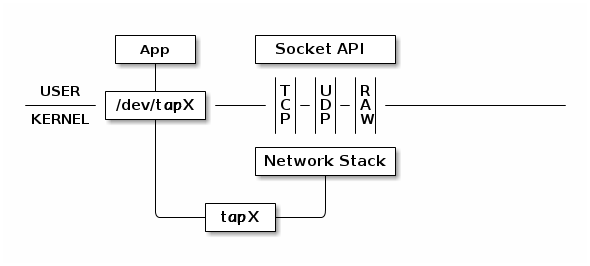

这篇文章主要介绍一下如何对我们的协议栈进行配置，使其能够连接到外部的网络。此外，还会顺带介绍一些在调试协议栈时经常使用的命令。

# 配置SNAT

如果你认真读了前几篇文章，并且源代码测试到了 **TCP** 这一部分的话，我想，你肯定会有这样一个想法,那就是我应该怎样使我的协议栈连接上互联网，这正是我接下来需要解决的问题。


依旧是前面的那张原理图：



我们知道，应用程序通过 **tapX** 接口发送的以太网帧会被传递到网络协议栈,在一般情况下，如果协议栈发现数据包的目的地址不是本机之后，会将数据包丢弃掉，但是如果我们开启了 **IP** 转发( **IP forward** )的功能之后，协议栈会帮我们实现数据的转发。

假定 **tapX** 的 **IP** 地址为 `10.0.1.5/24` ,我们协议栈模拟的 **IP** 地址是 `10.0.1.4/24` ,我们的系统还拥有一张真实的网卡，它的 **IP**地址为`192.168.140.133/24`,通过这个地址，我们可以连接到外网，`192.168.140.0/24` 这个网段默认的网关地址为 `192.168.140.2`.

如果我们想让我们的应用程序透过我们的协议栈连接百度的服务器，比如 `123.125.114.144`,从我们的协议栈发送一个数据包到 **tapX** 所代表的虚拟网卡，源 **IP** 是 `10.0.1.4` ，目的 **IP** 是 `123.125.114.114` ,怎么样才能够做到呢？

试想这样一种情况，协议栈接收到我们的数据包之后，将数据包的源 **IP** 地址进行替换，换成真实网卡的地址, `192.168.140.133` ,然后数据包通过真实网卡传递给网关，网关接收到数据后进行转发，百度的服务器接收到了数据，然后发送了一个响应，网关将这个响应传递给了我们的主机，然后我们的主机将响应数据包的目的 **IP** 替换为 `10.0.1.4` ，通过查询路由表可知，这个数据包应该走 **tapX** 接口，所以将响应数据包发送到 **tapX** 接口，这样的话，我们的应用程序通过读取 **/dev/tapX** 这个文件就可以读取到百度服务器发来的响应，这不正好实现了我们之前的想法吗？

前面的描述正是 **SNAT** 做的事情。你可能会感到奇怪，为什么主机要改变源 **IP** 地址，事情是这样的，如果不改变 **IP** 的话，响应的数据包是找不到我们的模拟协议栈的，至于为什么，我强烈建议你去补一补计算机网络的基本知识。

如何启用 **SNAT**，更加详细的步骤，推荐你看一下这篇文章：[如何在 Linux 上用 IP转发使内部网络连接到互联网](https://linux.cn/article-5595-1.html)

我这里以我的网络为例，来配置 **SNAT** 。

首先需要开启 **IPv4** 转发功能。

```shell
% sudo vim /etc/sysctl.conf # 不一定要使用vim，用nano或者你熟悉的编辑器皆可
```
然后添加 `net.ipv4.ip_forward=1` 到文件中，接下来启用更改:
```shell
% sudo sysctl -p /etc/sysctl.conf
```

接下来需要配置 **iptable** ,对于一般的 **linux** 主机而言，执行下面这一条足矣, **eth0** 是我可以连接外网的网络接口, **tap0** 是我模拟的虚拟网络接口,你需要按照自己电脑的情况自行将接口替换掉。

```shell
% iptables -t nat -A POSTROUTING -o eth0 -j MASQUERADE
```

如果不行的话，可以尝试一下下面这一组命令：

```shell
% sudo iptables -I INPUT --source 10.0.1.0/24 -j ACCEPT # 接收来自10.0.1.0/24这个网段的数据包
% sudo iptables -t nat -A POSTROUTING --out-interface eth0 -j MASQUERADE
% sudo iptables -A FORWARD --in-interface eth0 --out-interface tap0 -j ACCEPT
% sudo iptables -A FORWARD --in-interface tap0 --out-interface wlp2s0 -j ACCEPT
```

这里稍微插一句, **iptables** 有一个特别操蛋的性质，那就是一旦重启机器后，配置立马消失，为了解决这个问题，建议大家安装 **iptables-persistant** 这款软件，它会将规则文件保存在 `/etc/iptables/` 目录下,开机后自动加载.

**Debian** 系的 **linux** 一般可以通过 **apt** 命令进行安装：

```shell
sudo apt-get install iptables-persistant
```

# 常用的一些命令

更多关于 **linux** 网络的命令，个人推荐去看鸟哥的 **linux** 私房菜，服务器架设篇，前面设计的 **SNAT** 以及后面的一些命令，那本书里都有详细的介绍，值得一读。

## nc

## netstat

### netstat -tpn

-t 显示 **tcp** 协议的连接

-n 不将 **IP** 地址转化为主机称